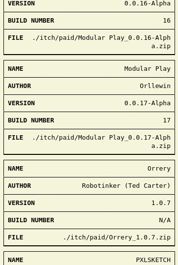
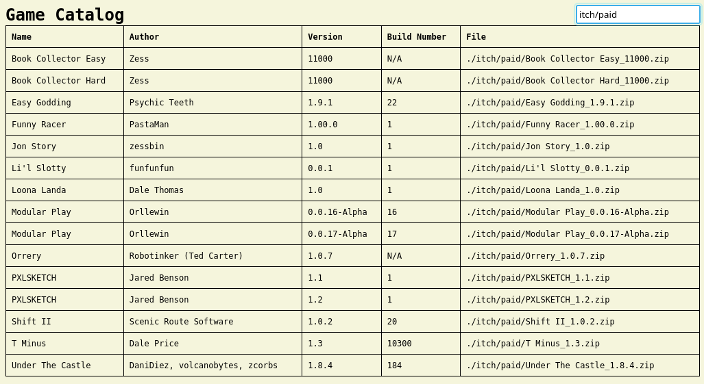

# A Set of Utilities to Help with Managing PDX Files

This document outlines a collection of utilities designed to assist in the management of PDX files. Among these utilities is a notable script that generates static HTML pages, providing a user-friendly view of your PDX file collection.

## Screenshots

